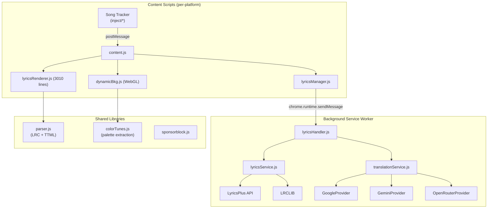
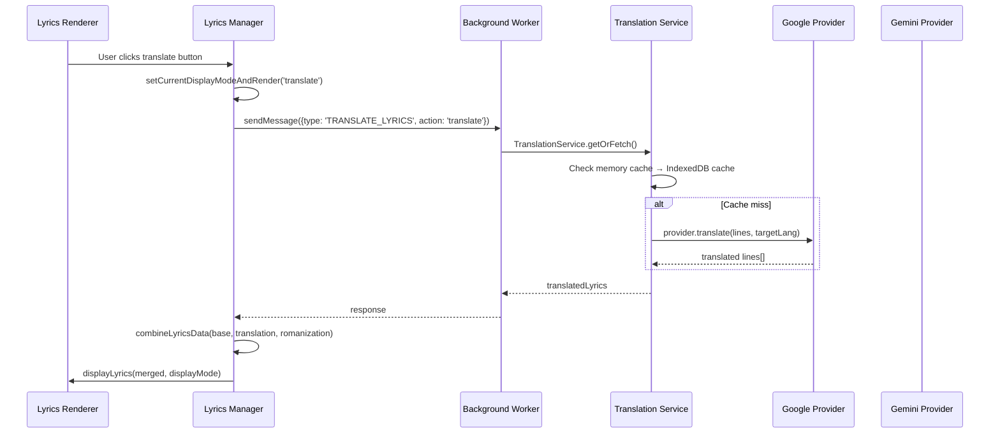

# YouLy+ Extension — Deep Analysis

> [!NOTE]
> This analysis covers the complete architecture, styling system, animation techniques, and translation features of the YouLy+ browser extension (v4.2.0) — an Apple Music-style lyrics renderer for YouTube Music, Apple Music, and Tidal.

---

## 📐 Architecture Overview



### Key Files & Sizes

| File | Lines | Purpose |
|------|------:|---------|
| [lyricsRenderer.js](file:///c:/Users/User/Music/Chill%20Player/.yolyplus_repo/src/modules/lyrics/lyricsRenderer.js) | 3,010 | Core rendering engine — syllable highlighting, scrolling, animation |
| [lyrics.css](file:///c:/Users/User/Music/Chill%20Player/.yolyplus_repo/src/modules/lyrics/lyrics.css) | 1,095 | All styling, animations, and keyframes |
| [dynamicBkg.js](file:///c:/Users/User/Music/Chill%20Player/.yolyplus_repo/src/modules/lyrics/dynamicBkg.js) | 841 | WebGL-based dynamic background with audio-reactive beat sync |
| [lyricsManager.js](file:///c:/Users/User/Music/Chill%20Player/.yolyplus_repo/src/modules/lyrics/lyricsManager.js) | 452 | Orchestrates fetching, caching, translation merging |
| [parser.js](file:///c:/Users/User/Music/Chill%20Player/.yolyplus_repo/src/lib/parser.js) | 687 | Parses LRC (enhanced) and Apple TTML to internal format |
| [translationService.js](file:///c:/Users/User/Music/Chill%20Player/.yolyplus_repo/src/all/translationService.js) | 193 | Translation/romanization orchestration with provider fallback |

---

## 🎨 Styling System (Apple Music-like)

### CSS Variable Design System

```css
/* Core palette — everything derives from this single color */
--lyplus-lyrics-pallete: #ffffff;

/* Typography */
--lyplus-font-size-base: 25px;
--lyplus-font-size-subtext: 0.6em;      /* background vocals, romanization */
--lyplus-font-size-metadata: 1.6em;

/* Blur (inactive line de-emphasis) */
--lyplus-blur-amount: 0.07em;           /* far lines */
--lyplus-blur-amount-near: 0.035em;     /* adjacent lines */

/* Active vs inactive text */
--lyplus-text-primary: var(--lyplus-lyrics-pallete);
--lyplus-text-secondary: #ffffff55;     /* 33% opacity white */
```

### Active Line Styling

The Apple Music aesthetic is achieved through **three simultaneous effects** on the active line:

1. **Scale pop**: Inactive lines sit at `scale3d(0.93, 0.93, 0.95)`, active lines smoothly scale to `scale3d(1.001, 1.001, 1)` — a subtle 7% size increase
2. **Opacity boost**: `0.8` → `1.0` with `mix-blend-mode: lighten`
3. **Blur de-emphasis**: Non-active lines get `filter: blur(0.07em)`, adjacent lines get lighter blur at `0.035em`

### Dual-Side Singer Layout (like Apple Music duets)

```css
/* Singer on the left gets right padding to push text left */
.dual-side-lyrics .lyrics-line.singer-left {
    padding-right: 20%;
}
/* Singer on the right gets left padding to push text right */
.dual-side-lyrics .lyrics-line.singer-right {
    padding-left: 20%;
}
```

The singer assignment algorithm (lines 1183-1260) mimics Apple Music's duet layout:
- **"group"** singers (choruses) → always left, transparent to alternation
- **"person"** singers → toggle left/right on each voice change
- If ≥85% of lines end up on one side, the entire layout is flipped

---

## ✨ Animation Engine — The Heart of YouLy+

### Word-by-Word Wipe Animation (CSS-driven, 60 FPS)

This is the signature feature. Instead of using JavaScript `requestAnimationFrame` to animate the highlight sweep, YouLy+ uses **CSS background-position animations** with `linear-gradient`:

```css
/* Each syllable uses a transparent text trick with background-clip */
.lyrics-syllable {
    color: transparent;
    background-color: var(--lyplus-text-secondary);   /* dim color */
    background-clip: text;
    -webkit-background-clip: text;
}

/* During highlight, a gradient sweeps left-to-right */
.lyrics-syllable.highlight {
    background-image:
        linear-gradient(90deg, #ffffff00 0%, white 50%, #0000 100%),
        linear-gradient(90deg, white 100%, #0000 100%);
    background-size: 0.5em 100%, 0% 100%;
    background-position: -0.5em 0%, -0.25em 0%;
}
```

The wipe animation itself:

```css
@keyframes wipe {
    from {
        background-size: 0.75em 100%, 0% 100%;
        background-position: -0.375em 0%, left;
    }
    to {
        background-size: 0.75em 100%, 100% 100%;
        background-position: calc(100% + 0.375em) 0%, left;
    }
}
```

**How it works:**
- Two overlaid background gradients simulate a soft-edged fill
- The first gradient is a 0.75em wide highlight "cursor"
- The second gradient fills behind it as it sweeps
- Each syllable gets its own CSS animation with calculated duration matching the lyric timing
- RTL text gets mirrored animations (`wipe-rtl`, `start-wipe-rtl`)

### Character-Level "Grow" Animation (Emphasis)

For short, sustained words (≤7 chars, ≥1000ms), YouLy+ creates per-character `<span class="char">` elements and applies the **grow-dynamic** animation:

```css
@keyframes grow-dynamic {
    0% {
        transform: matrix3d(1,0,0,0, 0,1,0,0, 0,0,1,0, 0,0,0,1);
        filter: drop-shadow(0 0 0 rgba(255,255,255,0));
    }
    25%, 30% {
        transform: matrix3d(
            calc(var(--max-scale) * ...),  /* per-char scale */
            0, 0, 0, 0,
            calc(var(--max-scale) * ...), 
            0, 0, 0, 0, 1, 0,
            calc(var(--char-offset-x) * ...), 
            var(--translate-y-peak, -2%), 0, 1
        );
        filter: drop-shadow(0 0 0.1em rgba(255,255,255,var(--shadow-intensity)));
    }
    100% {
        transform: translateY(-3.5%) translateZ(1px);
    }
}
```

Each character gets unique CSS custom properties:
- `--max-scale`: 1.07–1.17 based on word duration + position decay
- `--translate-y-peak`: -2% to -6% bounce
- `--char-offset-x`: horizontal spread based on character position
- `--shadow-intensity`: 0.4–0.8 glow

### Pre-Highlight Animation

Before a syllable's wipe begins, the **previous syllable** triggers a subtle "anticipation" glow on the next one:

```css
@keyframes pre-wipe-universal {
    from { background-position: -0.75em 0%, left; }
    to   { background-position: -0.375em 0%, left; }
}
```

This creates a **gradient crawl** — the soft edge of the highlight starts creeping toward the next syllable before its actual timing begins, creating a smooth visual flow.

### Scroll Animation System

Instead of `scrollTo({ behavior: 'smooth' })`, YouLy+ implements a **staggered CSS animation scroll**:

```css
@keyframes lyrics-scroll {
    from { transform: translateY(var(--scroll-delta)) translateZ(1px); }
    to   { transform: translateY(0) translateZ(1px); }
}
```

Each line gets an increasing delay:
```javascript
const delayIncrement = duration * 0.1;
// Line at active index: 0ms delay
// Line at active+1: ~40ms delay
// Line at active+2: ~80ms delay
// etc.
```

This creates a **waterfall/cascade scroll** effect where lines ripple into position one after another, mimicking Apple Music's spring-like scroll feel.

### Gap Dots Animation

Musical interludes show 3 animated dots:

```css
@keyframes gap-loop {
    from { transform: scale(1.1); }
    to   { transform: scale(0.9); }
}

@keyframes gap-ended {
    0%  { transform: translateY(-25%) scale(1); }
    35% { transform: translateY(-25%) scale(1.2); }  /* pop */
    100%{ transform: translateY(-25%) scale(0); }     /* shrink away */
}
```

---

## 🌐 Translation & Romanization System

### Architecture



### Translation Providers

| Provider | Type | Features |
|----------|------|----------|
| **Google Translate** | Default, free | Line-by-line batch translation, auto-fallback |
| **Gemini AI** | BYO API key | Custom prompts, romanization with syllable-level sync |
| **OpenRouter** | BYO API key | Multiple model support (e.g., `gemma-3n-e2b-it:free`) |

### Display Modes

| Mode | What's shown |
|------|-------------|
| `none` | Original lyrics only |
| `translate` | Original + translated subtitle below each line |
| `romanize` | Original + phonetic/romanized text below each line |
| `both` | All three: original + romanization + translation |

### Key Translation Features

1. **Label-provided translations**: TTML files from Apple Music can contain embedded `<translation>` and `<transliteration>` elements — YouLy+ extracts these first
2. **Word-synced romanization**: When Gemini provides syllable-level romanization, it's mapped 1:1 to the original syllables and displayed inline under each word
3. **Pure Latin detection**: `_isPurelyLatinScript()` skips romanization for lines already in Latin script
4. **Duplicate phonetic hiding**: `hidePhoneticDup` setting hides romanization when it matches the original text
5. **RTL-aware translation**: Four CSS layout cases handle RTL/LTR combinations for both original lyrics and translations
6. **Caching**: Translations cached in both memory (`state.js`) and IndexedDB (`database.js`), keyed by song+action+language

### Translation UI

- Translate button with SVG icon (translation symbol)
- Dropdown menu with contextual options:
  - "Show Translation" / "Hide Translation"
  - "Show Pronunciation" / "Hide Pronunciation"  
  - Loading spinner during fetch
- Keyboard/mouse accessible

---

## 🎆 Dynamic Background (WebGL)

### How It Works

The background is a **WebGL-rendered, multi-layer, audio-reactive artwork blur**:

1. **3 floating copies** of the album artwork, each rotated/scaled differently
2. **Two-pass Gaussian blur** (horizontal + vertical) applied via framebuffers
3. **Audio beat sync**: FFT analysis drives scale pulses and rotation speed
4. **Smooth artwork transitions** when songs change (crossfade at texture level)

```javascript
// Layer configuration
const ROTATION_SPEEDS = [-0.10, 0.18, 0.32];
const LAYER_SCALES = [1.4, 1.26, 1.26];
const PERIMETER_SPEEDS = [0.09, 0.012, 0.02];  // orbital motion

// Each layer orbits on its own elliptical path
const angle = t * 6.283185307;
const px = Math.abs(bx) * Math.cos(angle);
const py = Math.abs(by) * Math.sin(angle);
```

### Performance

- Renders at **256×256** resolution (tiny canvas, scaled up via CSS)
- Frame-capped at **40 FPS** to save battery
- Uses **VAO extensions** for minimal GPU state changes
- **Visibility observer** pauses rendering when canvas is off-screen
- Dithering via interlaced gradient noise prevents banding

---

## ⚡ Performance Optimizations

| Technique | Where Used |
|-----------|-----------|
| `content-visibility: auto` | Lyric lines — skip painting for off-screen elements |
| `will-change: transform, filter, opacity` | Active lines only — hint GPU compositing |
| `translateZ(0/1px)` | Force GPU layer promotion |
| CSS animations over JS | Wipe animations run on compositor thread |
| Binary search | `_getLineIndexAtTime()` with sequential hint for O(1) average |
| `IntersectionObserver` | Track visible lines, skip syllable updates for hidden ones |
| `ResizeObserver` with debounce | Responsive re-layout |
| Batched DOM reads/writes | `_updateSyllableAnimation()` separates read/calculation/write phases |
| Element ID caching | `_lineById` Map for O(1) element lookup |
| Reusable arrays | `_tempActiveLines`, `_animationParts`, `styleUpdates` — no GC pressure |
| Font measurement cache | `fontCache` + canvas context reuse |
| `_cachedCharSpans` | Pre-cached DOM references on each syllable/word |
| **Lightweight Mode** | Disables character-level grow animations for weaker hardware |

---

## 🎯 What to Port to Chill Player

### Must-Have for Apple Music Feel

1. **CSS-driven syllable wipe** — the background-clip + gradient-position technique
2. **Staggered cascade scroll** — per-line delay on scroll animations  
3. **Scale pop** on active lines (0.93 → 1.0)
4. **Blur de-emphasis** on non-active lines with near/far tiers
5. **Background vocal collapse** — `max-height: 0` → `4em` with opacity transition
6. **Gap dots** — 3 bouncing dots during instrumental breaks

### Translation Features to Port

1. **Multi-provider translation** (Google Translate + Gemini AI)
2. **Word-synced romanization** inline under each syllable
3. **Dropdown toggle UI** for show/hide translation/romanization
4. **RTL-aware layout** for translated text
5. **Translation caching** to avoid redundant API calls

### Dynamic Background to Port

1. **Multi-layer artwork blur** (can simplify to CSS blur if no WebGL)
2. **Audio-reactive beat pulsing** via Web Audio API FFT
3. **Album artwork color extraction** for dynamic theming

---

## 📊 Configuration Options

```javascript
const defaultSettings = {
    wordByWord: true,          // Word-by-word vs line-by-line
    lightweight: false,        // Disable char-level animations
    blurInactive: false,       // Blur non-active lines
    hideOffscreen: true,       // Skip rendering off-screen elements
    dynamicPlayer: false,      // WebGL background
    audioBeatSync: false,      // Audio-reactive background
    customCSS: '',             // User CSS injection
    translationProvider: 'google',
    romanizationProvider: 'google',
    largerTextMode: 'lyrics',  // 'lyrics' or 'romanization'
    useSongPaletteFullscreen: false,
    overridePaletteColor: '',
    bkgOverlap: true,          // Allow background vocals above main
};
```
